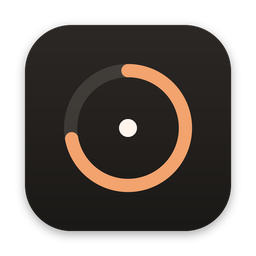

<p align="center"></p>

<h1 align="center">Drift</h1>
<p align="center"><em>Stay with it.</em></p>

Drift is a quiet focus timer for macOS. Press **⌥ Space** from any app, type `25`, press Return. A small timer appears in the top-left corner of your screen, and you get back to work.

It's free, open source, needs no account and never touches the network.

---

## Install

Paste this into **Terminal** and press Return:

```bash
curl -fsSL https://raw.githubusercontent.com/nweinberg97/Drift/main/scripts/install.sh | bash
```

The script builds Drift from source on your Mac, installs it to **Applications** and opens it. If macOS asks to install the free **Command Line Tools**, click Install, wait for it to finish, then run the command again.

Because Drift is built on your own machine, macOS opens it without the "unidentified developer" warning. You don't need a paid Apple account.

Requirements: macOS 13 Ventura or newer. If the build fails on an older Mac, update the Command Line Tools in **System Settings → General → Software Update**.

<details>
<summary>Other ways to install</summary>

- **From a clone:** `git clone https://github.com/nweinberg97/Drift && cd Drift && ./scripts/install.sh`
- **Prebuilt download:** every push builds a universal `Drift.zip` (with a SHA-256 checksum) under **Actions → latest run → Artifacts**. Builds downloaded this way are ad-hoc signed, not notarized, so the first time you open one you need to right-click Drift.app → **Open** → **Open**.
- **Just build it:** `./scripts/build-app.sh` creates `build/Drift.app`.

</details>

## Using Drift

| Do this | How |
|---|---|
| Start a timer | **⌥ Space**, type `25` → Return. An empty field + Return starts your default (25m). |
| Start a preset | **⌥ Space**, then **⌘1–⌘5**. Or pick one from the menu bar. |
| Speak | **⌥ V**, then say "start a 45 minute timer called writing". Drift stops listening when you pause. |
| Show / hide the widget | **⌥ T**. While hidden, the time shows in the menu bar and timers keep running. |
| Pause / resume | Click ⏸ on the widget, or type `pause` / `resume` in the launcher. |
| Adjust | Click the time to expand: **−5m · +5m · Edit · Cancel**. |
| Multiple timers | Start as many as you like. The widget shows one with a `+2` badge; click it to see them all. |
| Pomodoro | Type `pomodoro` or `50/10`, or press **⌘P** in the launcher. Focus and break alternate until you cancel. |
| Move it | Drag the widget anywhere. It remembers the position and display. |

### What you can type (or say)

```
25                25 minutes (a bare number means minutes)
1:30              1 hour 30 minutes
90s · 2h 15m · 36h · 3d · 1.5h
45m writing       → a timer named "Writing"
an hour and a half · half an hour · twenty five minutes
pomodoro · 50/10
pause · resume · pause laundry
add 5 minutes · take 5 minutes off focus
cancel the laundry timer · show my timers · hide
```

The launcher previews what Return will do as you type, so there are no surprises.

### Automation (Shortcuts, Siri, Raycast, Terminal)

Drift handles `drift://` links:

```bash
open "drift://start?duration=25m&name=Writing"
open "drift://run?q=45%20minutes%20reading"
open "drift://new"     # launcher
open "drift://voice"   # start listening
open "drift://show"    # drift://hide, drift://toggle
```

To use Siri, create a Shortcut with **Open URLs** → `drift://start?duration=25m`, name it something like "Focus", then say *"Hey Siri, focus."*

Any website can try to open a custom link, so links can only start, show, pause, resume or extend timers. They can never cancel or shorten one.

---

## 1. Product summary

Drift is a menu-bar utility with one floating widget. It does one job: it gets a timer running in under two seconds from anywhere, then stays out of the way.

- **Floating widget** (top-left by default). It's a single line showing the state dot, the optional name, the time and pause. Click the time to expand it. You can drag it, it remembers its position, and it shows above full-screen apps on every Space.
- **Launcher** (⌥ Space). A Spotlight-style field that parses natural language, shows a live preview, has preset chips and a mic button.
- **Voice** (⌥ V). Push-to-talk, recognised on-device, using the same command grammar as typing.
- **Multiple timers**. One featured timer plus an expandable tray, never a wall of widgets.
- **Menu bar**. A tiny ring that empties as time passes, every timer with a full submenu (pause, ±5m, edit, rename, duplicate, cancel), presets, Pomodoro, focus sound, settings.
- **Sound**. A soft synthesised start tick and a two-note completion bell. **Focus sound** is off by default and offers procedural brown noise, rain or a low ambient drone, all generated live and offline.
- **Notifications** are scheduled with macOS at start, so they arrive on time even if Drift is asleep or quit.
- **Settings** are one short page: default length, presets, finished-timer behavior, theme, widget size and opacity, sounds, shortcuts and launch at login.

## 2. Architecture

**A native Swift app**, not a browser extension. Every capability that mattered most needs the OS: a floating window above all apps and full-screen Spaces, global hotkeys, the menu bar, notifications, on-device speech and reliable background timing. An extension only lives inside a browser.

```
Sources/
  DriftCore/            Pure logic, no UI, fully unit-tested
    DriftTimer.swift      state machine: idle → running(endDate) ⇄ paused(remaining) → finished
    DurationParser.swift  "1h 30m", "45m writing", "an hour and a half" → seconds + name
    CommandParser.swift   typed/spoken commands → DriftCommand
    TimeFormatter.swift   7:32 · 1:42:18 · 27h 14m · 3d 6h
  Drift/                The app (SwiftUI views hosted in AppKit windows)
    App/                  entry point + wiring
    Model/                TimerStore (state, ticking, persistence), AppSettings
    Widget/  Composer/  MenuBar/  Settings/
    Shortcuts/            Carbon RegisterEventHotKey (global, no Accessibility permission)
    Voice/                SFSpeechRecognizer, on-device only
    Audio/                synthesised chimes + procedural focus sound (AVAudioEngine)
    Services/             notifications, command runner
```

Key decisions:

- **Timestamps, not ticks.** A running timer stores its `endDate`, and remaining time is `endDate − now`. Sleep, App Nap, a frozen UI or a force-quit can't make it drift. Timers that end while the Mac is asleep are marked finished on wake. Drift chimes only if the end was under a minute ago, so you never get chimed about something long past.
- **No polling loop.** The store wakes exactly when the visible second changes or a timer ends. With no running timers, Drift does nothing.
- **Non-activating panels.** Clicking the widget never steals focus from the app you're working in. The panel takes the keyboard only while you're typing into it.
- **SwiftUI inside AppKit.** SwiftUI handles views and animation. AppKit handles what SwiftUI can't do well: borderless panels, window levels, Spaces behavior, status items and hotkeys.
- **Local persistence.** Timers are saved as JSON in the app's container, written atomically on every change. Settings go in UserDefaults. There's no backend.
- **Security.** Drift is sandboxed with the hardened runtime. Its only entitlement is the microphone. It has no network entitlement at all, so it can't phone home even by accident. Speech recognition is required to run on-device.

## 3. Key UX decisions

- **One key, then type.** The fastest way to start a timer from anywhere is a launcher, not a button. ⌥ Space + `25` + Return takes about a second. Return on an empty field starts your default, so it's two keystrokes in total.
- **A bare number means minutes**, and `1:30` means hours:minutes, because that's what people mean. Leftover words become the name (`45m writing` → *Writing*), so you never have to fill in a name field.
- **A live preview under the field** shows exactly what Return will do ("Start 45:00 · Writing", "Pause · Laundry"). That removes the guesswork from parsing.
- **Push-to-talk voice, not a wake word.** An always-on "Hey Drift" would keep your microphone open all day, so voice listens only after ⌥ V and stops on silence. For hands-free use, Siri works through a Shortcut and a `drift://` link.
- **One featured timer.** Several timers collapse into a `+N` badge, and expanding shows a compact tray sorted by what ends soonest. Click any timer to feature it.
- **The accent color means "something is happening."** A warm ember accent marks only running timers, the last minute and completion. Everything else is warm neutral, so the widget is calm enough to leave on screen all day.
- **Tabular digits in a stable box.** The width changes only when the format does (10:00 → 9:59), never every second.
- **Hiding is safe.** The time moves into the menu bar, timers keep running, and ⌥ T brings the widget back.
- **Completion is quiet.** A soft bell and one notification, the widget shows *Done*, and +5m snoozes. Drift never auto-starts another timer unless you chose Pomodoro.
- **No onboarding screens.** On first launch the widget shows your default timer with ▶ and a one-line hint (`⌥ Space  new timer from anywhere`). The hint disappears once you've used the shortcut.

## 4. How to run it

```bash
# Install to /Applications and launch
./scripts/install.sh

# Or just build
./scripts/build-app.sh           # → build/Drift.app
open build/Drift.app

# Universal (Apple silicon + Intel); needs full Xcode
./scripts/build-app.sh --universal

# Unit tests (need Xcode, since the Command Line Tools ship without XCTest)
swift test
```

To open in Xcode: `open Package.swift`. Note that notifications and the app sandbox only apply when you run the bundled app, not `swift run`.

## 5. How to test it

**Automated** (`swift test`, run on every push by CI): duration parsing in every format above, command parsing (start, pause, resume, cancel, adjust, Pomodoro, show and hide, graceful failure), the timer state machine (pause/resume, ±5m, snoozing a finished timer, Pomodoro phases), timestamp accuracy at 5s, 25m, 90m, 24h and 36h, formatting, and save/load round-trips.

**By hand:**

- [ ] ⌥ Space in Chrome, VS Code and a full-screen app → type `25` → Return → the timer appears top-left
- [ ] Try `90s`, `1:30`, `2h 15m`, `36h`, `45m writing`, `pomodoro`. Each preview should be correct.
- [ ] Click the widget's pause while typing in another app. Keep typing: your keystrokes still land in that app.
- [ ] Click the time → −5m / +5m / Edit (`10m`) / Cancel
- [ ] Start 3 timers → `+2` badge → expand → click one to feature it
- [ ] Drag the widget, quit Drift, reopen → same place, timers still running
- [ ] ⌥ T hides it → time shows in the menu bar → ⌥ T brings it back
- [ ] Start a `5s` timer → bell + notification → *Done* → +5m snoozes
- [ ] Start a 2m timer, sleep the Mac for 5 minutes, wake → timer shows Done, with no late chime
- [ ] Unplug the external display the widget is on → it moves back to the main display
- [ ] Menu bar → Focus Sound on → start a timer → sound fades in. Pause → it fades out. Try each soundscape and the volume slider.
- [ ] ⌥ V → "start a 10 minute timer called break". Then try "pause", "add 5 minutes", "cancel the break timer" and "show my timers". Saying nonsense should give a friendly hint.
- [ ] Settings → re-record a shortcut → it works from other apps
- [ ] Turn on Reduce Motion and Increase Contrast. Use VoiceOver on the widget and menu.
- [ ] `open "drift://start?duration=3m&name=Tea"`

## 6. Known limitations

- **Not notarized.** Notarization needs a paid Apple Developer account. Building with the install script avoids the Gatekeeper prompt entirely. Prebuilt zips need right-click → Open the first time.
- **No custom wake word.** "Hey Drift" would mean an always-open microphone, which isn't worth it. Use ⌥ V, or "Hey Siri" with a Shortcut (see Automation).
- **Voice needs on-device speech.** Drift has no network access, so if your Mac hasn't downloaded the on-device speech model, voice will ask you to turn on **Dictation** (System Settings → Keyboard) once. Voice is English (US) for now.
- **macOS asks for permissions again after each rebuild** (microphone, notifications). Ad-hoc signatures change with every build. Signed releases would fix this.
- **Global shortcut conflicts.** If another app (often Alfred or Raycast with ⌥ Space) already owns a combination, macOS gives it to whichever app registered first. Reassign it in Settings.
- **Keyboard control of the widget itself** (space to pause, +/−, Return, Esc) works while the widget has focus, for example after Edit. From other apps, the launcher's commands (`pause`, `add 5 minutes`…) are the keyboard path. This is deliberate, so the widget never steals your typing.
- **No Siri / App Intents integration yet.** SwiftPM builds can't produce App Intents metadata. The `drift://` + Shortcuts route covers the same ground.
